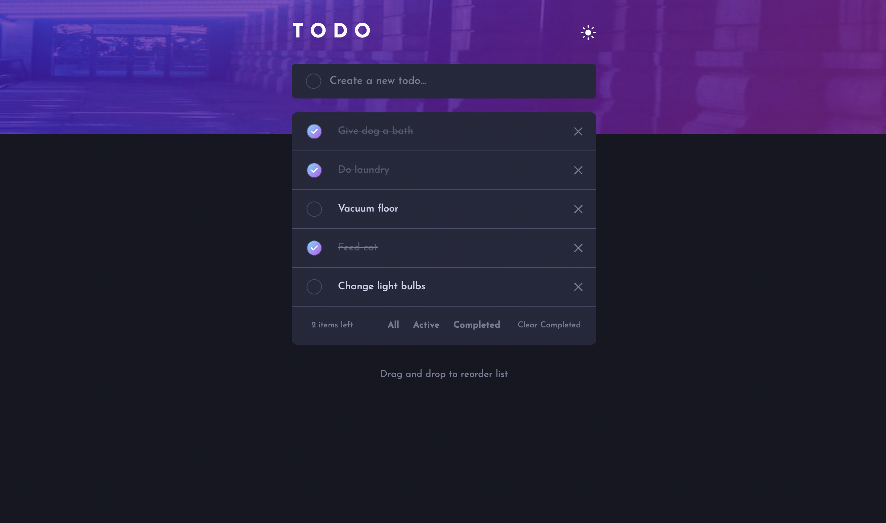
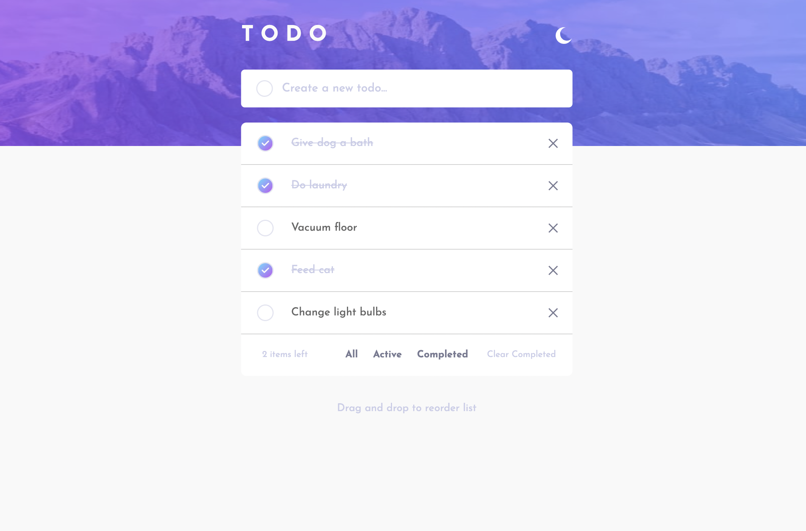
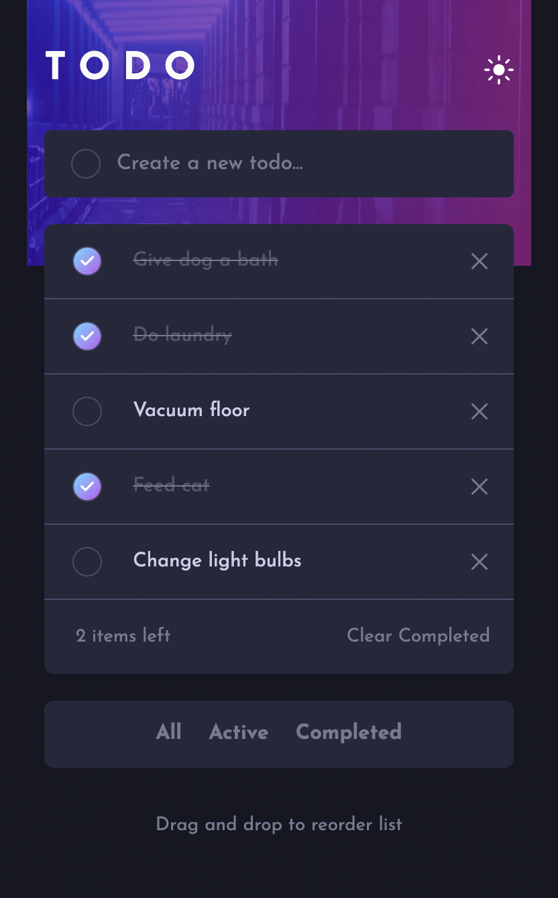
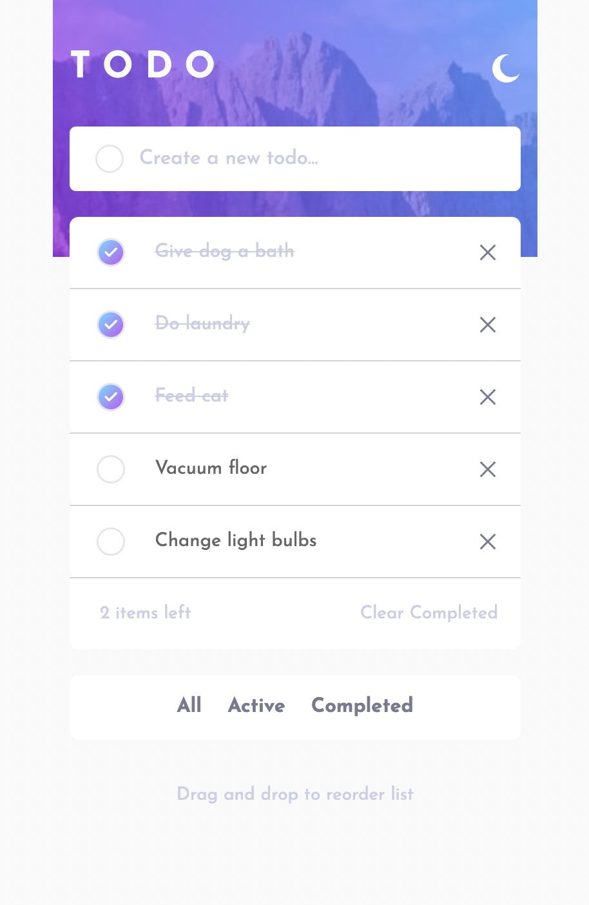
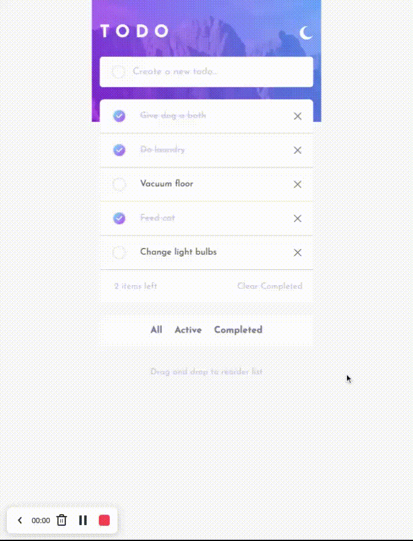

# 💥🔥⚡️ TODO APP Solution ⚡️🔥💥

## 📜 Table of contents

- [💥🔥⚡️ TODO APP Solution ⚡️🔥💥](#️-todo-app-solution-️)
  - [📜 Table of contents](#-table-of-contents)
    - [🔗 Links](#-links)
    - [📸 Screenshots](#-screenshots)
      - [🖥 Desktop Version | ☾ Dark Theme](#-desktop-version---dark-theme)
      - [🖥 Desktop Version | ☀︎ Light Theme](#-desktop-version--︎-light-theme)
      - [📱 Mobile Version | ☾ Dark Theme](#-mobile-version---dark-theme)
      - [📱 Mobile Version | ☀︎ Light Theme](#-mobile-version--︎-light-theme)
  - [🏗 Process:](#-process)
    - [🚀 Tech stack:](#-tech-stack)
    - [📚 What I learned?](#-what-i-learned)
  - [⚙️ App Functionality:](#️-app-functionality)
  - [🖌 Author:](#-author)

### 🔗 Links

- [Click here to see github repository](https://github.com/vasilemidrigan/todo-app)
- [Click here to open the app](https://vasilemidrigan.github.io/todo-app/)

### 📸 Screenshots

#### 🖥 Desktop Version | ☾ Dark Theme

#### 🖥 Desktop Version | ☀︎ Light Theme

#### 📱 Mobile Version | ☾ Dark Theme

#### 📱 Mobile Version | ☀︎ Light Theme

## 🏗 Process:

### 🚀 Tech stack:

- [ReactJS library](https://reactjs.org/) (as main technology)
- [Framer-Motion](https://www.framer.com/motion/) (for drag and drop tasks functionality)
- [Sass(scss) preprocessor](https://sass-lang.com/) (for styling)
- [NPM](https://www.npmjs.com/) (node package manager)
- Flexbox
- CSS custom properties
- Semantic HTML5 markup
- Mobile-first workflow

### 📚 What I learned?

- How a Drag and Drop library generaly works, and how to implement it into a React App
- React useState() Hook
- React props
- React forms
- Implement dark/light mode feature
- Right comments in our code makes it easier to read and mantain codebase
- NPM basic manipulations

## ⚙️ App Functionality:

- View the optimal layout for the app depending on their device's screen size
- Hover states for all interactive elements on the page
- Add new tasks to the list
- Mark tasks as complete
- Delete tasks from the list
- Filter by all/active/complete tasks
- Clear all completed tasks
- Tracker active tasks left
- Toggle light and dark mode
- Drag and drop for reordering items on the list

## 🖌 Author:

- Github - [vasilemidrigan](https://github.com/vasilemidrigan)
- LinkedIn - [Vasile Midrigan](https://www.linkedin.com/in/vasile-midrigan/)
- Website - [Vasile Midrigan](https://vasilemidrigan.github.io/)
- Frontend Mentor - [@vasilemidrigan](https://www.frontendmentor.io/profile/vasilemidrigan)
