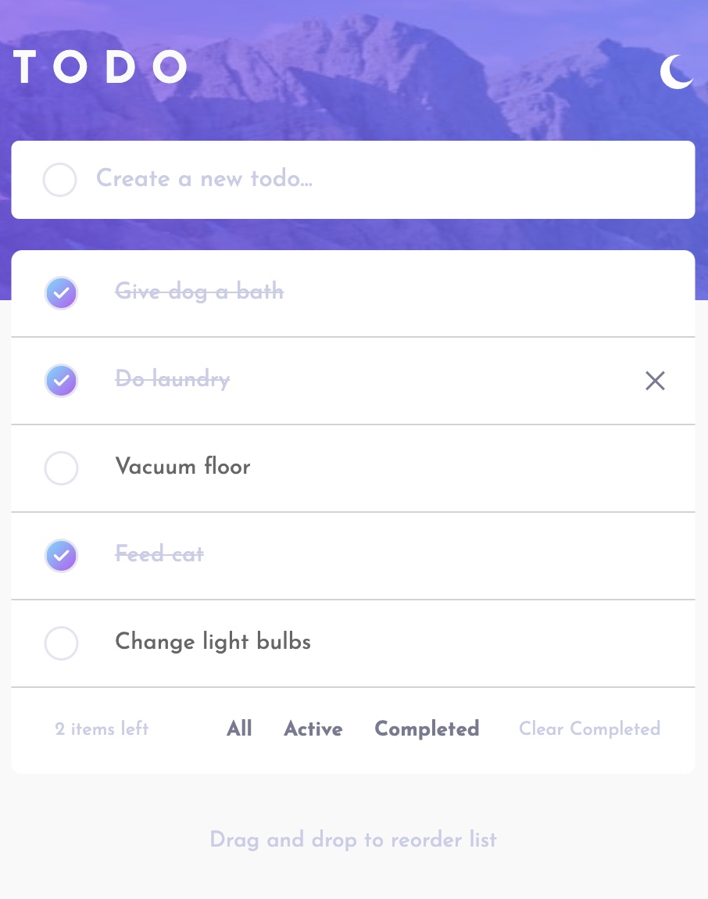

# Tasko

Web application for managing personal tasks.

## Screenshots

## Technologies

- React.js
- [Framer-Motion](https://www.framer.com/motion/) _drag and drop library_
- [Sass](https://sass-lang.com/)
- Flexbox
- Mobile-first workflow

## Usage

Open the application [here](https://vasilemidrigan.github.io/tasko/)

## Features

- Create a new task
- Delete a task
- Mark the task as done
- Browse by movie categories
- Filter showed task
- Clear completed tasks
- Reorder a task by dragging it
- Active tasks left tracker
- Light and Dark theme
